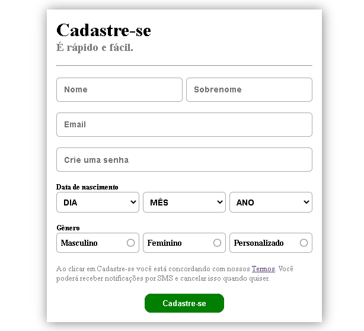

# EXERCÍCIO DE CRIAÇÃO DE FORMULÁRIO SIMPLES

Esse é um exercício proposto pelo curso DevQuest que eu aprimorei implementando o CSS e HTML.
O objetivo era criar um formulário parecido com o de cadastro do Facebook.

## Linguagens Utilizadas
- HTML5 
- CSS3

## Formulário Funcionando
Clique na imagem para acessar o formulário funcionando!

## Observações

- Caso queira utilizar fique atento para modificar o método na tag <form> e também altere o link dos termos.

